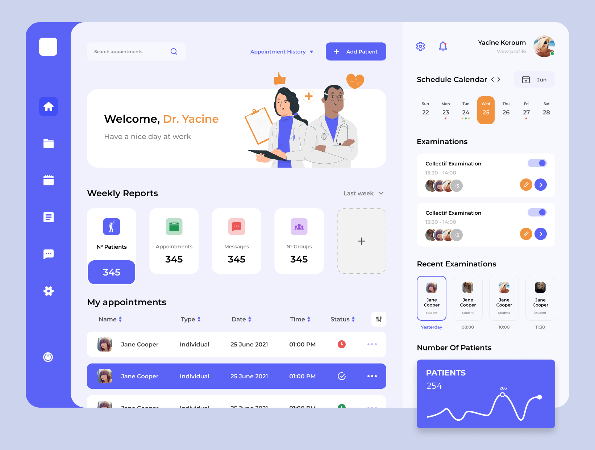
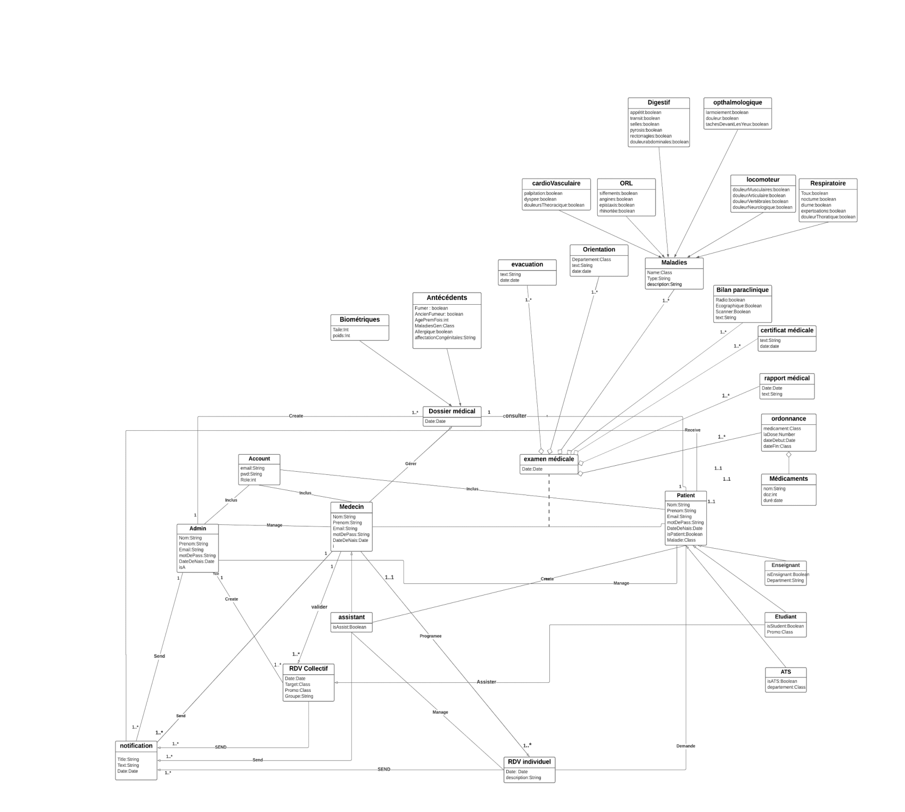

CLINITY 
===


 [View project specifications !](https://docs.google.com/document/d/1zSXcCNSuju0yjo6r1XsT2eeDOzfdce5G6oAezfQk198/edit)
 



## Summary :
#### ClINITY is a website app created to help people to book an appointment in aclinic online, so any clinic can use this app to organize the reservation time, besides that the client can pick the date and time . doctore can refuse , change or accept date and time
---

## How use this app as a developer

1. git clone the repo
2. run docker compose-up

if you have any question don't hesitate to ask :+1: 

User story
---

```gherkin=
    As a client, I can serve the website.
    As a client, I can reserve an appointment 
    As a client, I can choose the date of appointment besides the time.
```
```gherkin=
    As a doctor, I can view my calendar.
    As a doctor, I can accept or refuse an appointment 
    As a doctor, I can write and extract medical prescriptions.
    As a doctor, I can view my daily , weekly and monthly statistics.

```
```gherkin=
    As an admin, I can manage accounts.
    As an admin, I can view my daily , weekly and monthly statistics.
```


## Class schema



Used Technology
---
1. Nest Js
2. Express
3. React   )
4. Redux
5. Mysql
6. Docker

availble roles
---
1. admin
2. doctor
3. clinet(PATIENT)
4. doc assistant

Clinity provides
---
- appointement gesture
- accounts gesture
- medical folder gesture
- medical prescription gesture
- medical exams gesture

---
---
If you liked the repo then kindly support it by giving it a star ⭐ and share in your circles so more people can benefit from the effort.

## Contributions Welcome
[](#)

If you find any bug in the code or have any improvements in mind then feel free to generate a pull request.

## Issues
[](https://github.com/PROJET-3CS/clientWeb/issues)

If you face any issue, you can create a new issue in the Issues Tab and I will be glad to help you out.

